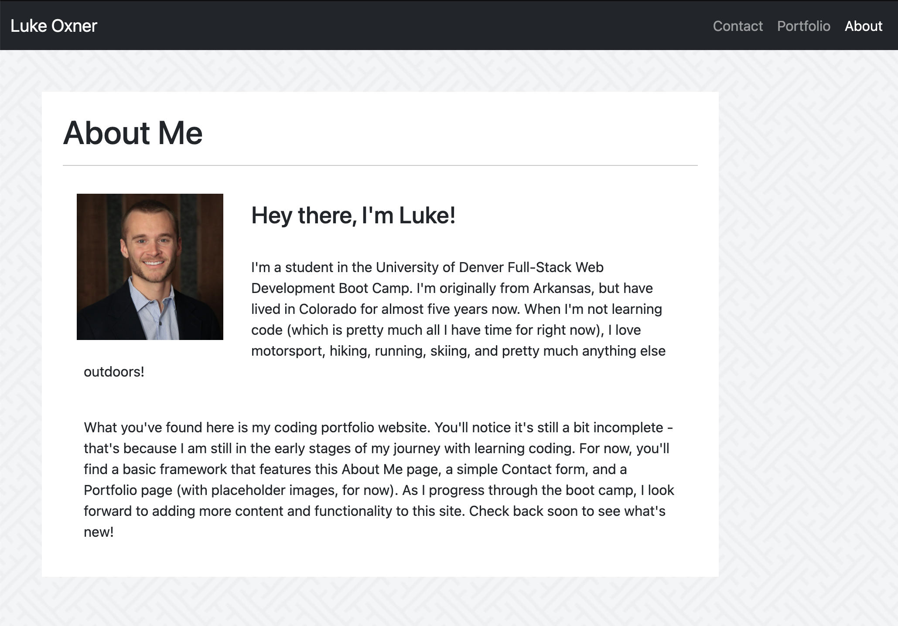

# portfolio

## Description

This is my second homework for the University of Denver Web Development Boot Camp! It's the basic framework of what will become my portfolio page for all the projects and applications I build. One of the key goals of this project was for the site to be "responsive" and adapt itself to look good for users accessing it through different sized devices. I achieved this using the Bootstrap framework. Each page uses a container that responsively adapts using the built-in Bootstrap breakpoints. Thanks to this feature of Bootstrap, I was able to achieve responsiveness without needing to add my own media queries in the CSS file.

## Deployment

The code (and associated assets) are hosted right here in this GitHub repository, and it's all live on the web thanks to GitHub pages. If you would like to check it out, you can view the site at the link below:

<a href="https://lukeoxner.github.io/portfolio" target="_blank"><b>portfolio Live Website</b></a>
  

 ## Credits
 
 This project was made using Bootstrap, HTML, and CSS. 
 Image sources are as follows: 
 Background image: <a href="https://www.toptal.com"><b>www.toptal.com</b></a> 
 Placeholder images: <a href="https://www.placehold.it"><b>www.placehold.it</b></a>
